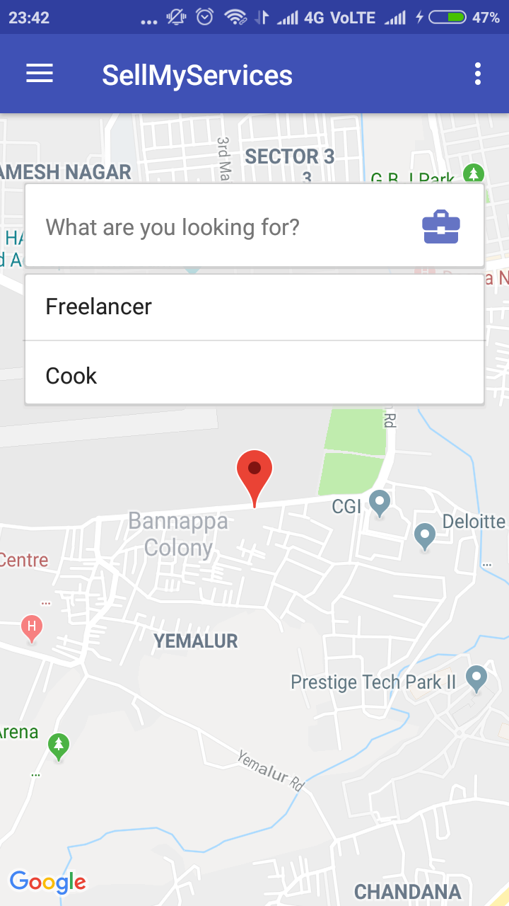
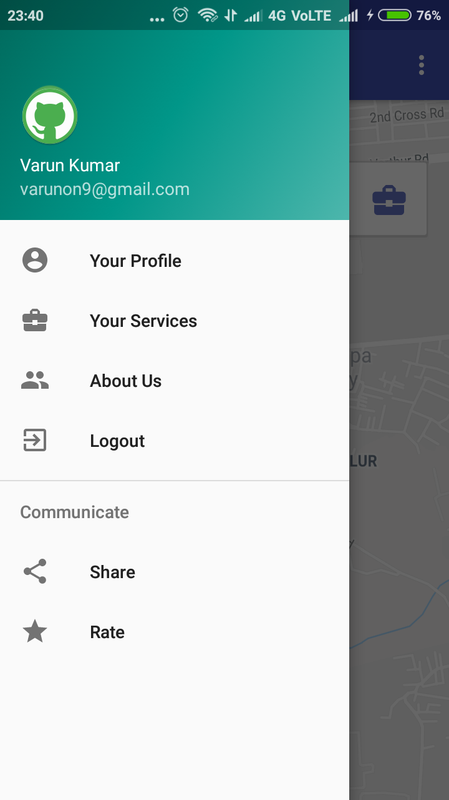
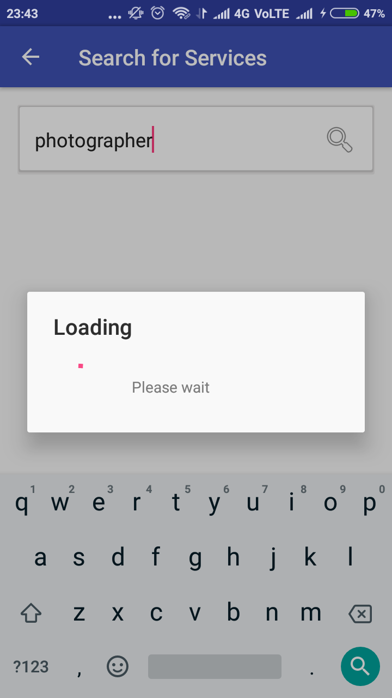
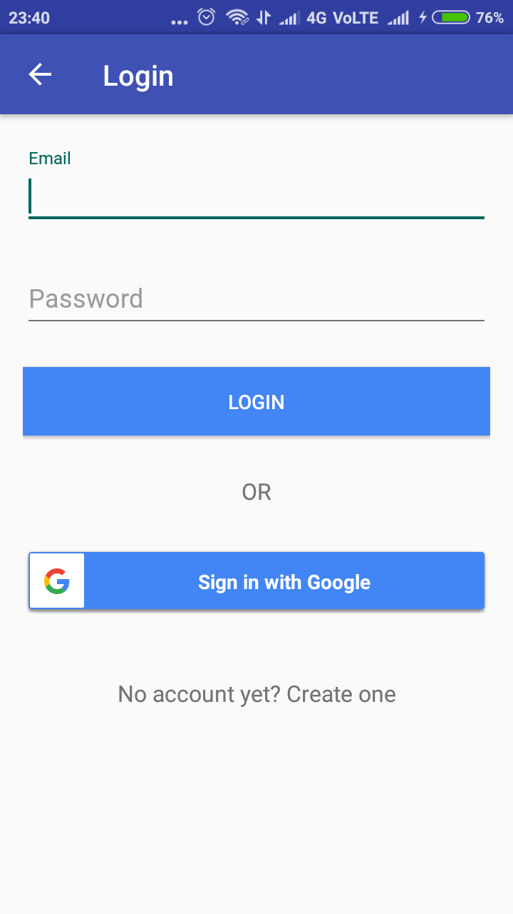
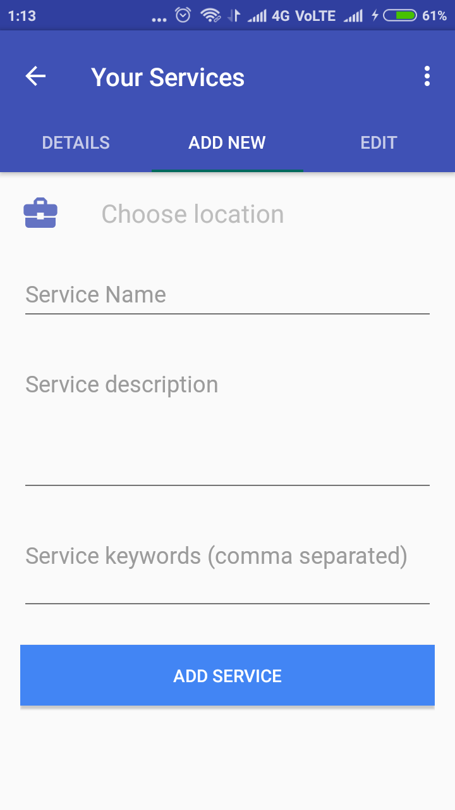

## sell-my-services

We help people to offer their services to others easily and quickly. SellMyServices is a platform where a seller can publish his
services. These services then can be searched by seekers in their nearby locations. 

### Android app link

#### Backend Repository
https://github.com/gawdsnitkkr/sell-my-services-backend/

#### How does it work?

1. A seller is a person who offers some service e.g. Photographer, Carpenter, Cook, Teacher, Doctor, Freelancer etc.
2. Seller register his services on our platform.
3. A seeker is a person who is in search of some service(s) e.g. a person looking to hire cook.
4. Seekers search services on our platform.
5. SellMyServices list all the nearby sellers who are offering services searched by seeker. 
6. Seeker then can browser seller's services, their ratings, location etc and if interested can directly chat to sellers.
7. After availing a service, a seeker can share feedback and rating to corresponding seller on our platform.

#### Screenshots

|  |  |
| --- | --- |
| | |
| | |
| | |

#### Demo video-
https://youtu.be/cio7xAiRjGE
